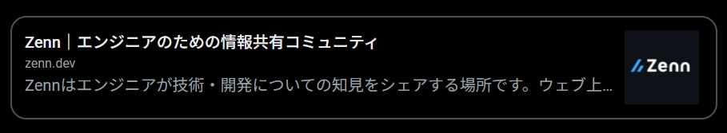

めっちゃ速い静的サイトジェネレータとして定評のある [Hugo](https://gohugo.io) ですが、その分動的な処理ができないので色々と工夫する必要があります。
関連記事やタグなど一般的なブログに必要な機能は標準で搭載されているし、shortcodes を使えば複雑な HTML も簡単に入れられますが、**外部サイトからは JSON か CSV しか取得できない**ので URL からリンクカードを生成しようと思ったら API サーバーを立てて経由させなければなりません。

とはいえビルド時にしか使わないのに外部のレンタルサーバーを使ったりするのは無駄が多いし、ローカルでプレビューするときも使えるような汎用性の高さも必要です。
ということで簡単な Docker イメージを作って GitHub Actions で使ってみたいと思います。

完成品はこちら。



## Open Graph から JSON を生成

これについては [otiai10/opengraph](https://github.com/otiai10/opengraph) というドンピシャなライブラリがあったのでそのまま使わせていただきました。

```go
package main

import (
	"encoding/json"
	"log"
	"net/http"

	"github.com/otiai10/opengraph"
)

func main() {
	http.HandleFunc("/", func(w http.ResponseWriter, r *http.Request) {
		og, err := opengraph.Fetch(r.FormValue("url"))
		if err != nil {
			http.Error(w, err.Error(), http.StatusInternalServerError)
		}

		w.Header().Set("Content-Type", "application/json")
		err = json.NewEncoder(w).Encode(og)
		if err != nil {
			http.Error(w, err.Error(), http.StatusInternalServerError)
		}
	})

	// 0.0.0.0 なのはコンテナの外からアクセスする時に localhost や 127.0.0.1 だと上手くいかないからです。もっと良い方法があったら教えてください＞＜
	log.Fatal(http.ListenAndServe("0.0.0.0:8080", nil))
}
```

あとは適当にビルドすれば OK です。

```dockerfile
FROM golang:1.17.7-bullseye AS builder

WORKDIR /go/src/ogjson
COPY . .
RUN go install

FROM gcr.io/distroless/base-debian11

COPY --from=builder /go/bin/ogjson /ogjson
CMD ["/ogjson"]
```

これで `docker run --rm -p 8080:8080 <image>` を実行すれば `http://localhost:8080/?url=https://example.com` みたいな感じで JSON が取得できるようになると思います。

## サービスコンテナを使う


サービスコンテナは、ワークフロー中でアプリケーションをテストもしくは運用するのに必要になるかもしれないサービスをホストするための、シンプルでポータブルな方法を提供するDockerコンテナです。 たとえば、ワークフローでデータベースやメモリキャッシュへのアクセスを必要とする結合テストを実行する必要があるかもしれません。


説明がふわっとしていますが、とにかくワークフローの中で Docker コンテナを動かせるようです。

```yaml
jobs:
  # 任意のジョブ名
  build:
    runs-on: ubuntu-latest

    services:
      # 任意のサービス名
      ogjson:
        # Docker Hub のイメージ名
        image: akimon658/ogjson:1.0.0
        ports:
          - 8080:8080
```

これだけ追記すれば Actions 内で JSON の取得を完結させられます。

## Shortcode の設定

Shortcodes は `layouts/shortcodes/` 以下に作ります。
ファイル名がそのまま shortcode の名前になるので好きな名前にしてください。

以下はこのブログで使っているものです。

```html
<!-- 引数、JSON を取得 -->
{{ $url := .Get 0 }}
{{ $json := getJSON "http://localhost:8080/?url=" $url }}

<!-- 外部リンクは target="_blank" をつけて開く -->
<a href="{{ $url | safeURL }}"{{ if strings.HasPrefix $url "http" }} target="_blank" rel="noopener noreferrer"{{ end }}>
  <div class="card">
    <div class="card-meta">
      <div class="card-title" title="{{ $json.Title }}">{{ $json.Title }}</div>
      <div class="card-host">{{ $json.URL.Host }}</div>
      <div class="card-description" title="{{ $json.Description }}">{{ $json.Description }}</div>
    </div>
    <!-- Image は配列になっているので最初の1枚だけ使う -->
    {{ range first 1 $json.Image }}
      
    {{ end }}
  </div>
</a>
```

ここではタイトル、ドメイン、descriptionと画像を使っていますが、他にも色々取得できると思います。
CSS は頑張って良い感じにしてください。

### Shortcode を呼び出す

```markdown

```



ということで、それっぽいものが作れました。

## あとがき

コンテナなので上手いことやれば [dev container](https://code.visualstudio.com/docs/remote/create-dev-container) との相性も良さそうですね。
